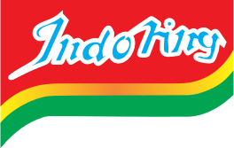

{height="160px"} {style="display:flex;justify-content:center"}

Selamat datang di Indoring! Ini adalah webring untuk situs web indie yang pemiliknya adalah orang Indonesia. Situs web apa pun diperbolehkan di sini, selama Anda mengikuti aturan di bawah. Situs Anda bahkan tidak perlu berbahasa Indonesia untuk mendaftar!

[](https://dabric.xyz/post/linkcircle/)

## Aturan
1. Situs tidak harus menyertakan konten yang secara spesifik berkaitan dengan kewarganegaraan Indonesia. Cuma pemiliknya harus orang Indonesia!
2. Tidak ada ujaran kebencian, konten diskriminatif, dan fanatisme.
3. Tidak ada konten dewasa. (gua masih di bawah umur so)

## Bagaimana saya bergabung?
Kirimkan saja email ke [leap123@tuta.io](mailto:leap123@tuta.io) dengan yang berikut:
```plain
Nama situs:
URL situs: (https:// tidak harus diperlukan)
Deskripsi pendek: (opsional tapi disarankan)
Tombol 88x31: (opsional tapi disarankan)
```
Mungkin perlu beberapa saat bagi saya untuk merespons dan menambahkan Anda ke webring, tetapi setelah Anda diterima, Anda dapat menambahkan salah satu dari yang berikut ke situs web Anda:

**Dengan gambar**
<div style="display:flex;justify-content:center;align-items:center;gap:1rem">
  <a href="#">← Sebelumnya</a>
  <a href="#"></a>
  <a href="#">→ Berikutnya</a>
</div>

```html
<div style="display:flex;justify-content:center;align-items:center;gap:1rem">
  <a href="https://leap123.neocities.org/indoring/go.html?prev=[URL situs tanpa https://]">← Sebelumnya</a>
  <a href="https://leap123.neocities.org/indoring/"></a>
  <a href="https://leap123.neocities.org/indoring/go.html?next=[URL situs tanpa https://]">→ Berikutnya</a>
</div>
```

**Hanya teks**
<div style="display:flex;justify-content:center;align-items:center;gap:1rem">
  <a href="#">← Sebelumnya</a>
  <a href="#">Indoring</a>
  <a href="#">→ Berikutnya</a>
</div>

```html
<div style="display:flex;justify-content:center;align-items:center;gap:1rem">
  <a href="https://leap123.neocities.org/indoring/go.html?prev=[URL situs tanpa https://]">← Sebelumnya</a>
  <a href="https://leap123.neocities.org/indoring/">Indoring</a>
  <a href="https://leap123.neocities.org/indoring/go.html?next=[URL situs tanpa https://]">→ Berikutnya</a>
</div>
```

Karena ini hanya HTML dan CSS dasar, ini dapat disesuaikan sesuai keinginan Anda.

<script src="linkcircle.min.js"></script>

## Anggota-anggota webring
[](https://leap123.neocities.org){data-lc-slug="leap123.neocities.org"}
**Pemilik:** leap123<br/>
**Deskripsi:** Situs web saya dengan blog. Posting kapan pun saya mau.<br/>
<br/>
[kekavigi](https://kekavigi.xyz/){data-lc-slug="kekavigi.xyz"}<br/>
**Pemilik**: kekavigi<br/>
**Deskripsi:** Kumpulan tulisan pribadi.
{data-linkcircle}
